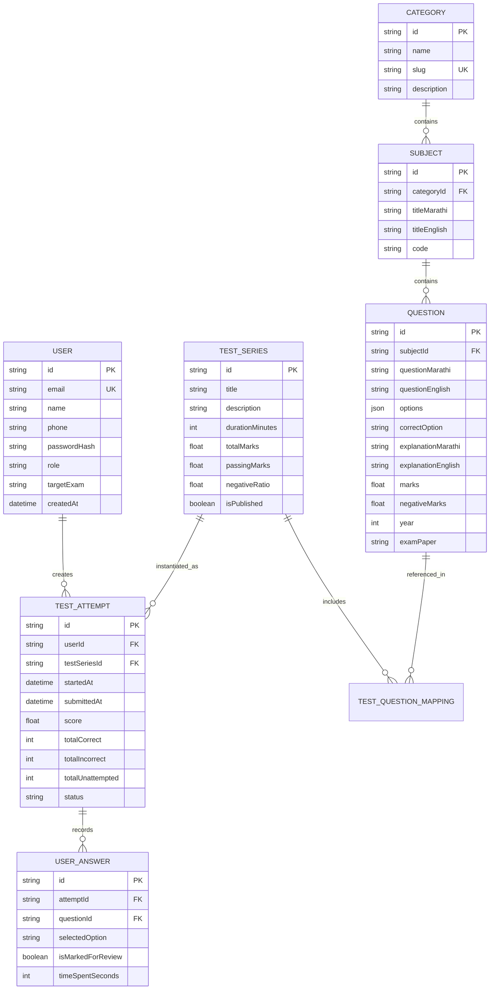

# Database Architecture & Entity Map: `mpscexam`

This document defines the relational data models, field definitions, indexes, and entity-relationship diagrams for the MPSC Exam system.

---

## 1. Entity-Relationship Diagram (Text / Mermaid)

---

## 2. Table Specifications & Indexes

### Table: `users`
* `id` (UUID / CUID, Primary Key)
* `email` (VARCHAR 255, Unique, Indexed)
* `name` (VARCHAR 255)
* `phone` (VARCHAR 20, Nullable)
* `password_hash` (TEXT)
* `role` (ENUM: `ASPIRANT`, `SME`, `ADMIN`, Default: `ASPIRANT`)
* `target_exam` (VARCHAR 100, Nullable)
* `created_at` (TIMESTAMP WITH TIME ZONE, Default: `NOW()`)

### Table: `questions`
* `id` (UUID / CUID, Primary Key)
* `subject_id` (UUID, Foreign Key -> `subjects.id`, Indexed)
* `question_marathi` (TEXT)
* `question_english` (TEXT)
* `options` (JSONB: Array of `{ key: string, textMarathi: string, textEnglish: string }`)
* `correct_option` (VARCHAR 10)
* `explanation_marathi` (TEXT)
* `explanation_english` (TEXT)
* `marks` (NUMERIC(4,2), Default: 2.00)
* `negative_marks` (NUMERIC(4,2), Default: 0.50)
* `year` (INTEGER, Indexed)
* `exam_paper` (VARCHAR 100, Indexed)
* `created_at` (TIMESTAMP WITH TIME ZONE)

### Table: `test_attempts`
* `id` (UUID / CUID, Primary Key)
* `user_id` (UUID, Foreign Key -> `users.id`, Indexed)
* `test_series_id` (UUID, Foreign Key -> `test_series.id`, Indexed)
* `started_at` (TIMESTAMP WITH TIME ZONE)
* `submitted_at` (TIMESTAMP WITH TIME ZONE, Nullable)
* `score` (NUMERIC(6,2), Nullable)
* `total_correct` (INTEGER, Default: 0)
* `total_incorrect` (INTEGER, Default: 0)
* `total_unattempted` (INTEGER, Default: 0)
* `status` (ENUM: `IN_PROGRESS`, `SUBMITTED`, `ABANDONED`, Default: `IN_PROGRESS`)
